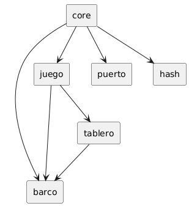
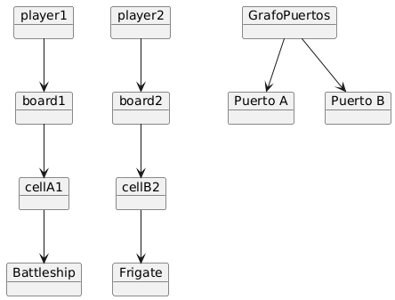

# HUNDIR LA FLOTA
---

## DIAGRAMA DE CLASES


## DIAGRAMA DE COMPONENTES





## DIGRAMA DE OBJETOS 





---

## 🧩 Características

- **3 tipos de barcos**:
  - 🛳 `Battleship` (5 posiciones, se hunde al impactar todas las partes)
  - 🚤 `Frigate` (3 posiciones)
  - 🛶 `Canoe` (1 posición)

- **Sistema de juego por turnos entre dos jugadores**

- **Colocación personalizada de barcos en el tablero**

- **Patrón de diseño Builder** para la creación modular de barcos

- **Estructuras de datos avanzadas**:
  - Tabla hash para almacenar información de los barcos
  - Grafo no dirigido para representar conexiones entre puertos

- **Diseñado para pruebas automáticas** (`JUnit`)

---

## 🛠️ Tecnologías Utilizadas

- Java 11+
- Maven
- JUnit 5
- PlantUML (para diagramas en `/DOCS`)

---

## 🚀 Cómo Ejecutar el Proyecto

1. Clonar el repositorio:

```bash
git clone https://github.com/YoelUb/Hundir-La-Flota/e](https://github.com/YoelUb/Hundir-La-Flota)
cd BatallaBarcos
